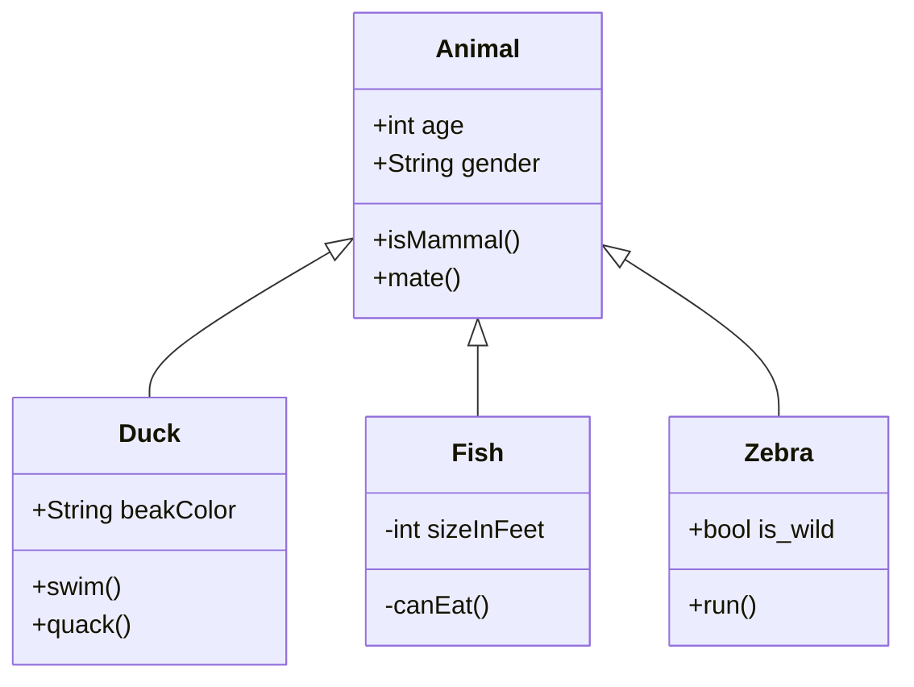

# Document Sequence diagram

## Diagram

## Description

Lorem ipsum dolor sit amet, consectetur adipiscing elit. Aenean et felis dapibus leo tempor placerat. Pellentesque interdum nibh vitae purus placerat eleifend. In venenatis condimentum commodo. Proin porttitor erat in nisi gravida hendrerit. Maecenas fringilla, arcu et consequat hendrerit, orci nunc egestas quam, id elementum odio augue ut massa. Sed in imperdiet ligula. Praesent nunc massa, interdum id metus eu, tincidunt mollis ante.